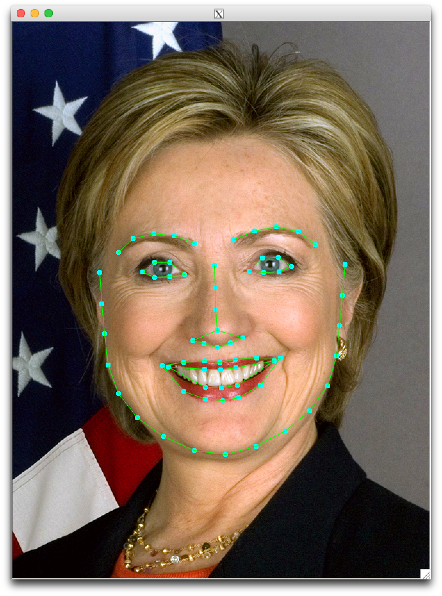
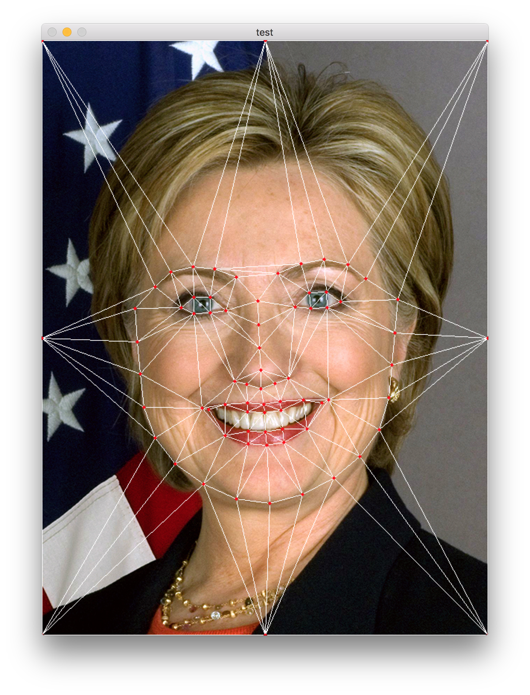
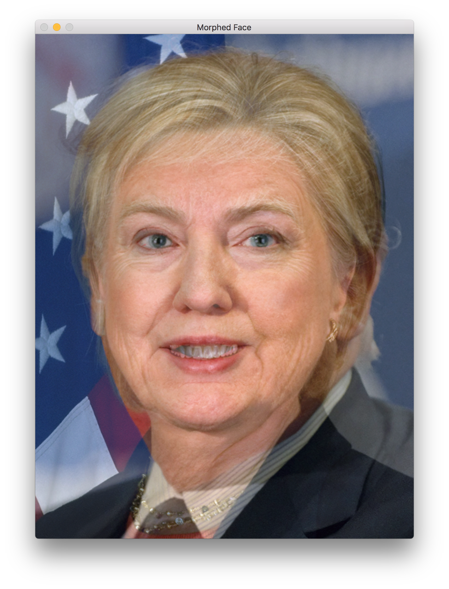
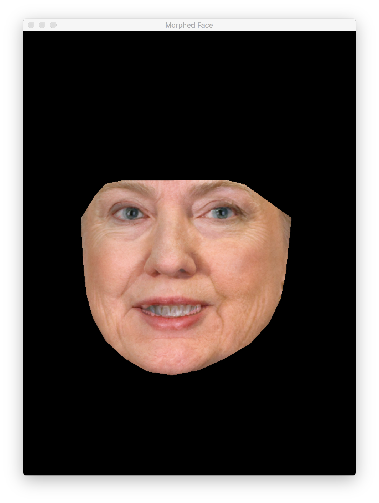

# MagicMorpher
- A tool for face morphing
- Algorithm is based on [this website](http://www.learnopencv.com/face-morph-using-opencv-cpp-python/#download)
- Basically, we firstly do face feature detection and then do Delaunay triangulation. Finally we blend corresponding traingular in two photos to target picture. 
- Code is commented in detail

## Result Showing
### Initial Photo (Hillary and Trump)

### Feature Detection

### Delaunay triangulation

### Morphing Result
morphing result：
 

morphing without boundary
 

## Usage
`./MagicMorpher /path/shape_predictor_68_face_landmarks.dat /path/1.jpg /path/2.jpg /path/target.jpg 0.5 1 0`

- First parameter is a pretrained facial landmark detector, you can download from [http://dlib.net/files/shape_predictor_68_face_landmarks.dat.bz2](http://dlib.net/files/shape_predictor_68_face_landmarks.dat.bz2)
- Second parameter is the first photo to do morphing
- Third parameter is the second photo to do morphing
- Fourth parameter is target picture's file name
- Fifth parameter alpha is to which degree it agrees with first photo (between 0 and 1, with 1 most liking first photo)
- Sixth parameter is whether to add boundary，(0 or 1)
- Seventh parameter is whether in DemoMode，0 or 1. If 1, then the program will present middle result of feature detection and Delaunay triangulation, Otherwise not. 

## Code
### Dependencies
- opencv3.2.0
- dlib
- libjpeg
- If you want to compile locally, please modify header search paths, framework search paths and library search paths to adjust local opencv, dlib, libjpeg path

### code structure
- FaceLandmarkGetter is to subtract face landmarks
- Trianglationer is to do Delaunay triangulation using face landmarks
- Finally in main.cpp we accomplish mapping to target image

## Shortcoming
- Not enough face landmark to do whole head reconstruction
- Lack of feature detection outside of face
- Need both photo to be front look and similar size

